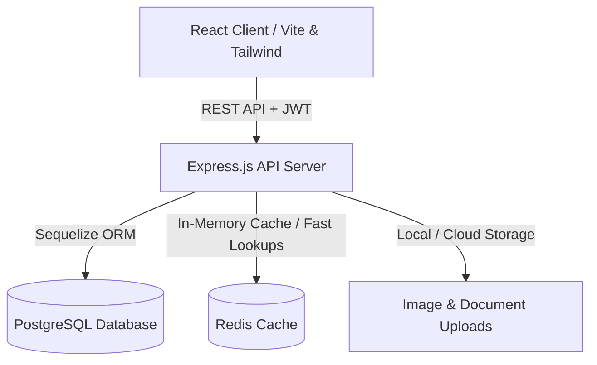

# 🌾 Rice Mill & Stock Management System (ERP)

A full-stack Enterprise Resource Planning (ERP) platform engineered for end-to-end rice mill operations, paddy procurement, multi-stage quality sampling, lorry transit logistics, stock bifurcation, production outturns, hamali labor accounting, and automated financial patti calculations.

---

## 📑 Table of Contents

- [Overview](#-overview)
- [Key Features & Modules](#-key-features--modules)
- [System Architecture](#-system-architecture)
- [Workflow Pipeline](#-workflow-pipeline)
- [Tech Stack](#-tech-stack)
- [Project Directory Structure](#-project-directory-structure)
- [Getting Started](#-getting-started)
  - [Prerequisites](#prerequisites)
  - [Environment Configuration](#environment-configuration)
  - [Installation & Running Locally](#installation--running-locally)
  - [Docker Setup](#docker-setup)
- [Database Migrations & Seeders](#-database-migrations--seeders)
- [Role-Based Access Control (RBAC)](#-role-based-access-control-rbac)
- [Clean-Up & Maintenance](#-clean-up--maintenance)
- [Deployment](#-deployment)
- [License](#-license)

---

## 🌟 Overview

The **Rice Mill & Stock Management System** streamlines complex agricultural supply-chain and milling workflows into a unified, real-time dashboard. From the initial gate sample to multi-lorry delivery, quality testing, outturn calculation, and final financial settlement, every operation is audited and synchronized across supervisors, managers, and administrators.

---

## 🚀 Key Features & Modules

### 1. 🔬 Paddy Procurement & Quality Workflow
* **Sample Entries**: Multi-type tracking (`Mill Sample (MS)`, `Location Sample (LS)`, `Direct Vehicle (DV)`, `Ready Lorry (RL)`).
* **Multi-Stage Quality Checking**: Moisture percentage, cutting (raw & processed), bend tests, grain counts, mix ratios (S-Mix, L-Mix), Kandu, oil, SK, discoloration, and smell indicators.
* **Cooking Quality Reports**: Cooking trials evaluation, culinary results, and cooking approval workflows.
* **Price Offering & Approvals**: Base rates, sute calculation, hamali, brokerage, LF rates, and manager-staged approval queues.

### 2. 🚚 Loading Lots, Trips & Physical Inspection
* **Supervisor Allotment**: Automated & manual assignment of physical supervisors for lot loading.
* **Progressive Load Tracking**: Real-time per-trip inspection (Top, Middle, Bottom, Half Lorry, Full Lorry / Gutti sampling stages).
* **Dispute & Re-inspection Handling**: In-field quality dispute triggers, recheck stages, and admin resolution.

### 3. 🏭 Arrivals, In-Transit & Band Mall Book
* **Lorry Transit Management**: Transit status, dispatch timestamps, and route monitoring.
* **Weighbridge Integration**: Dual Weighbridge support (**Mill WB** and **Party WB**) with gross, tare, net weight, sute deductions, and difference tracking.
* **Godown & Kunchinittu Placement**: Destination routing to warehouses, godowns, or production lines.
* **Mill Quality Sampling**: Before-unloading lot average vs. full lorry average inspections with direct Approve, Reject, and Recheck actions.

### 4. 💰 Financial Patti Generation & Settlement
* **Dual Patti Modes**: Instant generation of **Mill WB Patti** and **Party WB Patti**.
* **Dynamic Sute Net Weight Subtraction**: Precise calculation of $\text{Net WB} - \text{Shoot} = \text{S.Net WB}$.
* **Dynamic Additions & Deductions**:
  * Configurable Hamali (@/bag or @/qtl), Brokerage (@/qtl or @/bag), and LF (@/bag or @/qtl).
  * Custom alphanumeric additions with `Add:` prefix.
  * Dedicated `Less: DF` and `Less: WB` deduction fields with one-click deletion (`✕`) and restoration buttons (`+ Add Less DF` / `+ Add Less WB`).
* **Instant Patti Printing**: Print-optimized layouts formatted for invoicing and supplier handoffs.

### 5. 🍚 Rice Production & Outturn Analysis
* **Production Processing**: Conversion tracking from raw paddy to finished rice varieties.
* **By-Product Tracking**: Automated logging of Bran, Broken Rice, Rejection, and Husk.
* **Yield & Recovery Calculations**: Real-time outturn percentage and efficiency metrics.

### 6. 📦 Inventory, Stock Bifurcation & Warehousing
* **Multi-Location Inventory**: Real-time stock counts across warehouses, silos, and mills.
* **Palti (Bag-to-Bag Transfer)**: Seamless inventory transformation and batch transfers.
* **Loose Bag Entries**: Flexible handling of loose packaging and standard packaging sizes (26 Kg, 40 Kg, 50 Kg, 75 Kg).

### 7. 👷 Hamali & Labor Accounting
* **Hamali Books**: Dedicated rate books for Paddy Hamali, Rice Hamali, and Other Hamali Works.
* **Automated Wage Computation**: Per-bag and per-quintal automatic rate calculations for unloading, stacking, and loading.

---

## 🏗 System Architecture



---

## 🔄 Workflow Pipeline

```
[Gate / Staff Sample Entry]
           │
           ▼
[Lab Quality Check] ──(Cooking Pass)──► [Cooking Report]
           │                                   │
           ▼                                   ▼
[Lot Selection / Rate Finalization] ◄──────────┘
           │
           ▼
[Lot Allotment & Supervisor Assignment]
           │
           ▼
[Physical Inspection & Lorry Loading (Top/Mid/Bot/Full Avg)]
           │
           ▼
[In-Transit / Band Mall Book]
           │
           ▼
[Mill Weighbridge (Mill WB / Party WB) & Godown Placement]
           │
           ▼
[Mill Quality Sampling (Before Unloading & Gutti)]
           │
           ▼
[Arrival Approval ➔ Stock Inventory Added]
           │
           ▼
[Completed Lots ➔ Automated Financial Patti Settlement]
```

---

## 💻 Tech Stack

### Frontend
- **Framework**: React 18 (TypeScript)
- **Styling**: Tailwind CSS, Custom CSS Print Directives
- **Routing**: React Router DOM v6
- **Icons**: Lucide React
- **HTTP Client**: Axios with Interceptors

### Backend
- **Runtime**: Node.js (v18+) / Express.js
- **ORM**: Sequelize (PostgreSQL)
- **Authentication**: JWT (JSON Web Tokens) with Role-Based Middleware
- **Caching**: Multi-level Redis & in-memory route caching
- **File Uploads**: Multer, Sharp (Image Optimization)

### Infrastructure & DevOps
- **Containerization**: Docker, Docker Compose
- **Cloud Hosting**: Render / Vercel / Zeabur
- **Database**: PostgreSQL 14+

---

## 📁 Project Directory Structure

```text
stocks-main/
├── client/                     # Frontend React (TypeScript) application
│   ├── public/                 # Static assets & icons
│   ├── src/
│   │   ├── components/         # Reusable UI modals, tables, navigation
│   │   ├── contexts/           # Auth, Location, & Notification Contexts
│   │   ├── pages/              # Arrivals, CompletedLots, Dashboard, etc.
│   │   ├── services/           # Frontend API client services
│   │   ├── utils/              # Formatting, toasts, and helpers
│   │   └── App.tsx             # Main routing & application root
│   ├── package.json
│   └── tsconfig.json
│
├── server/                     # Backend Express REST API
│   ├── config/                 # Database & Redis configuration
│   ├── middleware/             # Auth, role-validation & caching middlewares
│   ├── migrations/             # Sequelize database migration scripts
│   ├── models/                 # Sequelize Data Models (SampleEntry, Arrival, etc.)
│   ├── repositories/           # Data access repository layer
│   ├── routes/                 # Express API endpoints
│   ├── seeders/                # Default seeders (Users, Warehouses, Hamali)
│   ├── services/               # Core business logic services
│   ├── utils/                  # Audit loggers, role resolvers, pagination
│   ├── validators/             # Request payload validators
│   ├── index.js                # Server entry point
│   └── package.json
│
├── Dockerfile                  # Container build instructions
├── docker-compose.yml          # Multi-container local deployment
├── render.yaml                 # Render cloud deployment blueprint
├── vercel.json                 # Vercel deployment configuration
├── .gitignore                  # Git ignore rules
└── README.md                   # Project documentation
```

---

## 🚀 Getting Started

### Prerequisites
- **Node.js**: v18.0.0 or higher
- **npm** or **yarn**
- **PostgreSQL**: v14 or higher
- **Redis** (Optional for local development, recommended for production caching)

### Environment Configuration

Create a `.env` file in the `server/` directory:

```env
PORT=5000
NODE_ENV=development
CLIENT_URL=http://localhost:3000

# Database Configuration
DB_NAME=mill_software
DB_USER=postgres
DB_PASSWORD=your_postgres_password
DB_HOST=localhost
DB_PORT=5432

# Authentication
JWT_SECRET=your_super_secret_jwt_key
JWT_EXPIRES_IN=7d

# Optional Redis
REDIS_URL=redis://localhost:6379
```

Create a `.env` file in the `client/` directory:

```env
REACT_APP_API_URL=http://localhost:5000/api
```

---

### Installation & Running Locally

#### 1. Setup Backend
```powershell
cd server
npm install
npm run migrate      # Run database migrations
npm run seed         # Seed initial users & default configurations
npm run dev          # Starts server on http://localhost:5000
```

#### 2. Setup Frontend
```powershell
cd ../client
npm install
npm start            # Starts React app on http://localhost:3000
```

---

### Docker Setup

Run the entire stack (PostgreSQL + Server + Client) with a single command:

```powershell
docker-compose up --build
```

---

## 🔐 Role-Based Access Control (RBAC)

The application implements granular, permission-gated access across operational roles:

| Role | Access Level |
| :--- | :--- |
| **Owner / Admin / CEO / MD** | Full administrative rights, user management, rate linking approvals, edit decisions, financial patti overrides, database backups. |
| **Manager** | Lot allotments, price finalization, supervisor assignments, workflow stage transitions, hamali rates management. |
| **Quality Supervisor** | Initial sample quality testing, Lab parameters entry, Cooking trials reporting. |
| **Physical Supervisor** | Loading lot progressive sampling (Top/Mid/Bot/Full Avg), vehicle number recording, dispute raising. |
| **Inventory / Staff** | Gate sample creation, weighbridge entry, godown placement, stock intake. |

---

## 🧹 Clean-Up & Maintenance

To keep the repository fast, clean, and production-ready:
* Unwanted temporary search scripts, ad-hoc dump logs, and `.graphify*` index caches are strictly ignored in `.gitignore`.
* Run database index optimization:
  ```powershell
  node server/scripts/add-critical-indexes.js
  ```

---

## 🚢 Deployment

* **Render**: Configured via [`render.yaml`](render.yaml) for automated web service and database deployment.
* **Vercel**: Configured via [`vercel.json`](vercel.json) for static client hosting.
* **Docker**: Configured via [`Dockerfile`](Dockerfile) and [`docker-compose.yml`](docker-compose.yml).

## ☁️ AWS Cloud & Hosting Questions

### Requirements:
* **System**: Run complete Frontend and Backend 24/7.
* **Active Users**: 25 to 30 Active Users.
* **Storage**: Store database data + uploaded photos, bills, receipts, and PDF files.
* **Performance**: Must be fast, smooth, and have the best performance without lag or crashing.

---

### Questions:
1. **How much will it cost per month to host and run this entire software (Frontend + Backend + Database) 24/7 on AWS?**
2. **Can we safely store all our data and uploaded photos/files, and how much will file storage cost per month?**
3. **Will the server handle 25 to 30 active users at the same time with the best, fastest performance and zero lag?**
4. **If server traffic increases or if more users are added, can it easily handle the load without slowing down?**
5. **Are there any extra or hidden charges per month (for user logins, data transfer, or database storage)?**
6. **Data Backup & Disaster Recovery**:
   * How are automated daily/weekly backups of the complete database and uploaded files created and safely saved to AWS S3 / Google Drive?
   * If the server crashes, hard drive corrupts, or accidental deletion occurs, how fast can we restore our entire data with zero data loss?
   * How many days/months of backup history are kept (e.g. 30 days retention)?
   * How much extra will automated backup storage cost per month?

---

## 📄 License

Proprietary Software — Developed for **Sri Krishna Constructions / KBD Rice Mill**. All rights reserved.